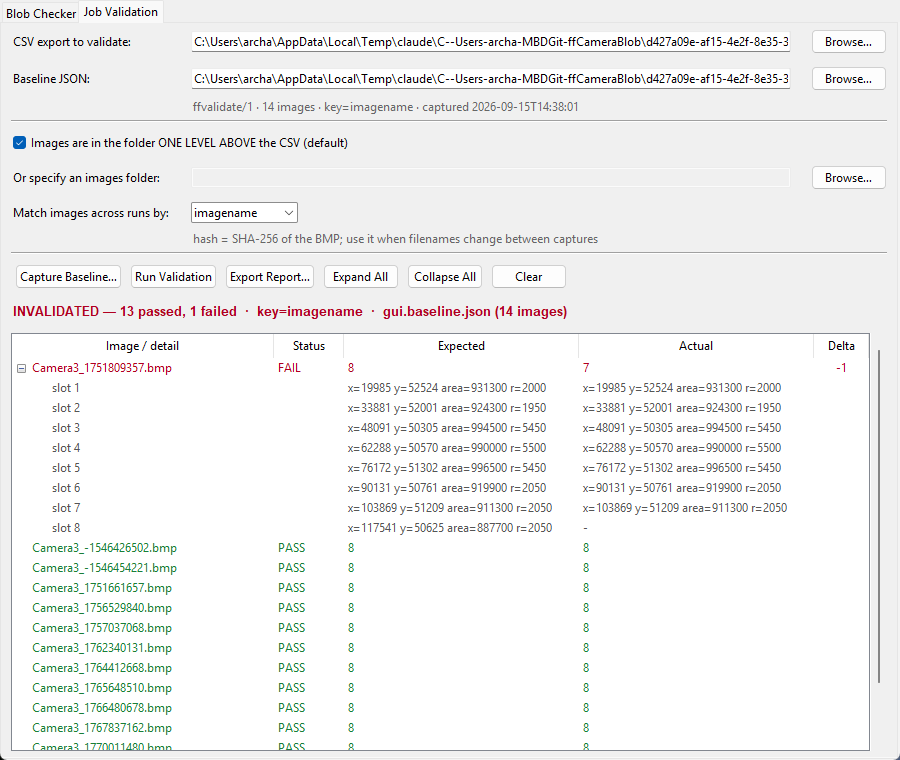

# FastForward Blob Checker

A lightweight GUI tool (Tkinter + Python) to analyze **FastForward camera CSV exports** and manage underperforming image results.  
It parses `.csv` logs generated by vision applications, compares the `BlobNumResults` column to an expected maximum, and then **logs, moves, or copies failed `.bmp` files** into a timestamped `failed/` subfolder.

---

## Features
- 📂 **CSV Analysis**: Parse `FastForward_<recipe>_<camera>.csv` files.
- 🔢 **Blob Check**: Compare `BlobNumResults` against an expected maximum.
- 🖼 **Image Management**:
  - Move (destructive) or Copy (non-destructive) under-max `.bmp` files.
  - Default **image source** = one folder above the CSV.
  - Default **failed folder** = same folder as the CSV.
  - Automatically creates `failed_<timestamp>/` subfolders.
- 📝 **Logging**: Generates a `failed_log_<timestamp>.csv` alongside the analyzed CSV.
- 🪟 **GUI**: Simple Tkinter interface, no command-line knowledge needed.
- 📦 **Portable EXE**: GitHub Actions builds a standalone `.exe` and `.zip` release for Windows users.

---

## Example
Generating the CSV file in Automation Studio


Analysis of CSV file


---

## Job Validation

Catches unintended changes to the vision job. Capture a run you have confirmed
is good as a **baseline**, then diff later exports against it. Modeled on the
Cognex In-Sight "Job Validation" workflow. Available both as the **Job
Validation** tab in the GUI and as `ff_validate.py` on the command line — they
share the same reader and produce identical verdicts and interchangeable
baseline files.

**The verdict is `BlobNumResults`.** Each blob is a feature that either
registers or it doesn't, so a part dropping from 8 detections to 7 is a
regression. A blob whose area moved 3% is not — that's normal variation, and it
does not fail a run.



### GUI

Open the **Job Validation** tab, pick the CSV export and a baseline, then
**Run Validation**. Every image is listed with PASS/FAIL, its expected and
actual count, and a delta; failing rows expand to show the expected blob slots
against the actual ones, so you can see *which* feature stopped registering.
**Capture Baseline…** writes a new baseline next to the CSV.

### CLI

```bash
# capture the expected results
python ff_validate.py baseline good_run.csv -o baseline.json

# after editing the vision app, re-export and check
python ff_validate.py run new_run.csv -b baseline.json
```

```
FAIL  Camera3_1751809357.bmp
        BlobNumResults               E:8              A:7

  passed      13
  failed      1

INVALIDATED
```

Exits `0` when everything matches, `1` on any failure, so it drops straight into
CI or a pre-release check.

Add `--verbose` to list the blob slots under each failure — the missing feature
shows as an expected side with no actual:

```
        slot 7   E: x=103869 y=51209 area=911300 r=2050    A: x=103869 y=51209 area=911300 r=2050
        slot 8   E: x=117541 y=50625 area=887700 r=2050    A: -
```

**Matching images across runs** (`--key`, or the dropdown in the GUI):

| mode | matches on | use when |
|---|---|---|
| `imagename` (default) | the `ImageName` cell | the job replays a fixed stored image set |
| `hash` | SHA-256 of the `.bmp` | images keep their pixels but get renamed (e.g. `Camera3_<epoch>.bmp` re-captured) |
| `index` | row ordinal | same corpus, same order, no stable names |

**Per-blob metrics.** `--metrics` makes area/radius/position drift fail a run
too, checked against tolerances (2% on areas and lengths, 5% on
`InnerCircleRadius`, 5 px on positions). Off by default. With it, `--fields`
restricts which metrics are tested and `--tolerance FIELD=rel:N|abs:N` overrides
a limit; the `tolerances` block of the baseline JSON sets them permanently. The
GUI is always count-only.

Other options: `--order slot` to compare raw slot order instead of sorting blobs
left-to-right, `--json` / `--report` for machine-readable output,
`--max-failures 0` to print every failure.

> **Note.** `baseline` records what the job *did*, not what it *should* do —
> exactly like Cognex's "Accept All". Baseline a run you have actually verified,
> or you will faithfully confirm a bug forever.

---

## Utilities

### `collect_failed.sh`
A helper script to consolidate results after multiple runs.

- Moves all `.bmp` files from timestamped `failed_YYYYMMDD_HHMMSS/` subfolders into a central `aggregate_failed/` folder.
- Removes the original `failed_YYYYMMDD_HHMMSS/` subfolders.
- Deletes any `failed_log*.csv` files in the current directory.

Usage (Linux/macOS, or Windows with Git Bash / WSL):
```bash
./collect_failed.sh
````

---

## Installation (Local Development)
Requires Python 3.10+ and Tkinter (bundled with Python).

```bash
git clone https://github.com/hevel86/ffCameraBlob.git
cd ffCameraBlob
pip install -r requirements.txt
python ff_blob_checker_gui.py
```

---

## Usage
1. Launch the GUI:
   ```bash
   python ff_blob_checker_gui.py
   ```
2. Select a `FastForward_<recipe>_<camera>.csv` file.
3. Enter the expected `BlobNumResults` (max).
4. Choose:
   - **Analyze (no move/copy)** → Just report results.
   - **Analyze & Execute** → Move/Copy under-max `.bmp` files.
5. Results appear in the log area; a CSV log is saved.

---

## Automated Windows Releases
This repo uses **GitHub Actions + PyInstaller** to publish portable Windows binaries.

- Tag a version (e.g., `v1.0.0`):
  ```bash
  git tag v1.0.0
  git push origin v1.0.0
  ```
- The workflow:
  - Builds a standalone `.exe` with PyInstaller.
  - Packages a `.zip` with the EXE, README, and LICENSE.
  - Publishes both as assets in the GitHub Release.

Find the latest release under:  
👉 [Releases](../../releases)

---

## Example Output
- `dist/ff_blob_checker_gui-1.0.0-windows-x64.exe`
- `dist/ff_blob_checker_gui-1.0.0-windows-x64-portable.zip`
- `failed_log_20250825_142033.csv` in the same folder as your CSV
- `failed/failed_20250825_142033/` containing under-max `.bmp` files

---

## License
MIT — see [LICENSE](LICENSE).
